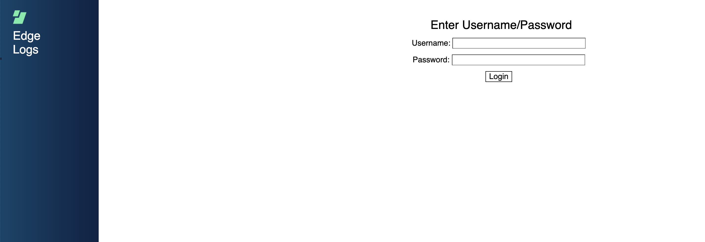
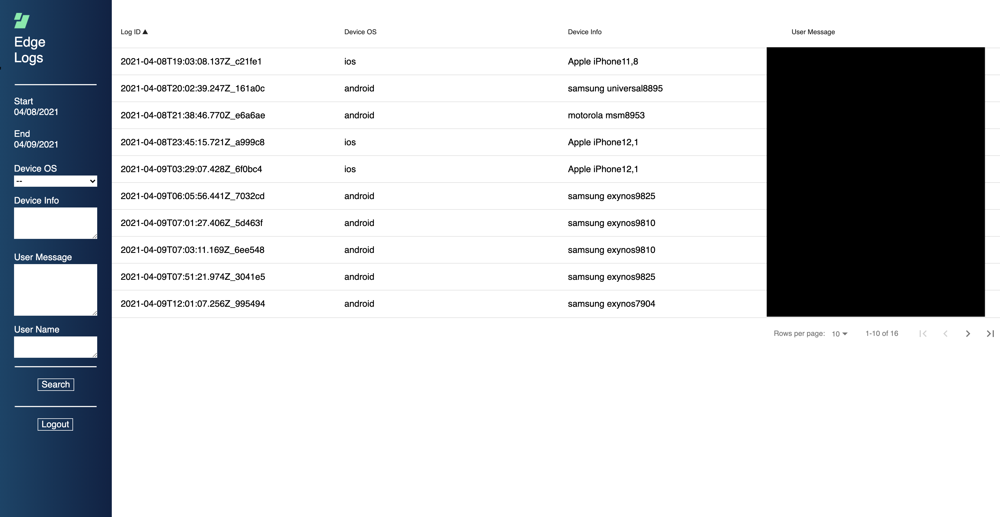
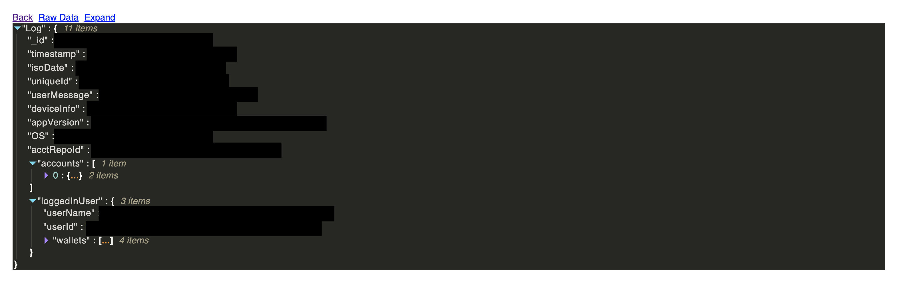

# edge-logs-server

## Provides interface for searching user logs

### Login page:

### Overview of logs:

### Breakdown of log info:

### Installation

Install Yarn

    https://linuxize.com/post/how-to-install-yarn-on-ubuntu-18-04/

Install Node

    curl -sL https://deb.nodesource.com/setup_10.x -o nodesource_setup.sh
    sudo bash nodesource_setup.sh

